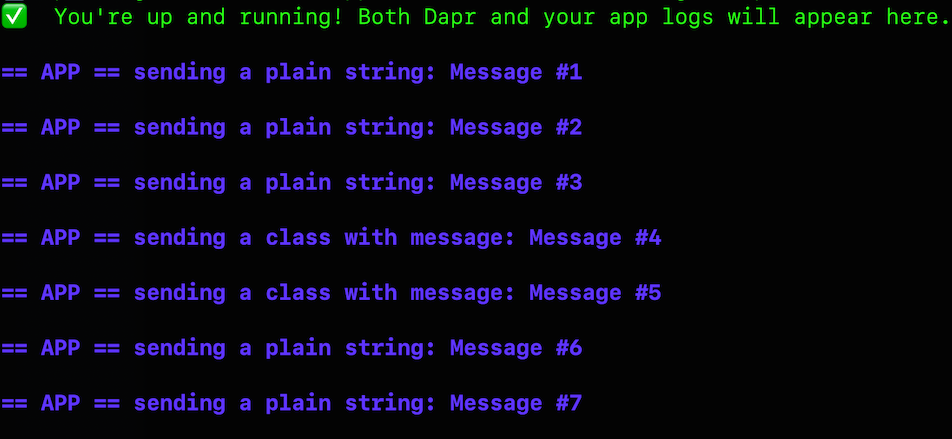
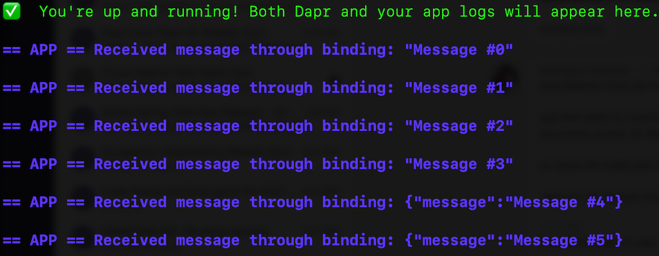

# Dapr Bindings Sample

In this sample, we'll create two java applications: an output binding application and an input binding application, using Dapr Java SDK. 
This sample includes two applications:

* InputBindingExample (Initializes the Dapr Spring boot application client)
* OutputBindingExample (pushes the event message)

Visit [this](https://github.com/dapr/docs/tree/master/concepts/bindings) link for more information about Dapr and bindings concepts.
 
## Binding sample using the Java-SDK

In this example, the component used is Kafka but others are also available.

Visit [this](https://github.com/dapr/components-contrib/tree/master/bindings) link for more information about binding implementations.


## Pre-requisites

* [Dapr and Dapr Cli](https://github.com/dapr/docs/blob/master/getting-started/environment-setup.md#environment-setup).
* Java JDK 11 (or greater): [Oracle JDK](https://www.oracle.com/technetwork/java/javase/downloads/index.html#JDK11) or [OpenJDK](https://jdk.java.net/13/).
* [Apache Maven](https://maven.apache.org/install.html) version 3.x.

### Checking out the code

Clone this repository:

```sh
git clone https://github.com/dapr/java-sdk.git
cd java-sdk
```

Then build the Maven project:

```sh
# make sure you are in the `java-sdk` directory.
mvn install
```
### Setting Kafka locally

Before getting into the application code, follow these steps in order to setup a local instance of Kafka. This is needed for the local instances. Steps are:

1. navigate to the [repo-root]/examples/src/main/java/io/dapr/examples/bindings
2. Run `docker-compose -f ./docker-compose-single-kafka.yml up -d` to run the container locally
3. Run `docker ps` to see the container running locally: 

```bash
342d3522ca14        kafka-docker_kafka                      "start-kafka.sh"         14 hours ago        Up About
a minute   0.0.0.0:9092->9092/tcp                               kafka-docker_kafka_1
0cd69dbe5e65        wurstmeister/zookeeper                  "/bin/sh -c '/usr/sb…"   8 days ago          Up About
a minute   22/tcp, 2888/tcp, 3888/tcp, 0.0.0.0:2181->2181/tcp   kafka-docker_zookeeper_1
```
Click [here](https://github.com/wurstmeister/kafka-docker) for more information about the kafka broker server.

### Running the Input binding sample

The input binding sample uses the Spring Boot´s DaprApplication class for initializing the `InputBindingController`. In `InputBindingExample.java` file, you will find the `InputBindingExample` class and the `main` method. See the code snippet below:

```java
public class InputBindingExample {

  public static void main(String[] args) throws Exception {
    ///..
    // If port string is not valid, it will throw an exception.
    int port = Integer.parseInt(cmd.getOptionValue("port"));

    // Start Dapr's callback endpoint.
    DaprApplication.start(port);
  }
///...
}
```

`DaprApplication.start()` Method will run an Spring Boot application that registers the `InputBindingController`, which exposes the actual handling of the event message as a POST request. The Dapr's sidecar is the one that performs the actual call to this controller, based on the binding features and the output binding action. 

```java
@RestController
public class InputBindingController {

  @PostMapping(path = "/bindingSample")
  public Mono<Void> handleInputBinding(@RequestBody(required = false) byte[] body) {
    return Mono.fromRunnable(() ->
      System.out.println("Received message through binding: " + (body == null ? "" : new String(body))));
  }

}
```

 Execute the follow script in order to run the Input Binding example:
```sh
cd to [repo-root]/examples
dapr run --app-id inputbinding --app-port 3000 --port 3005 -- mvn exec:java -D exec.mainClass=io.dapr.examples.bindings.InputBindingExample -D exec.args="-p 3000"
```

### Running the Output binding sample

The output binding application is a simple java class with a main method that uses the Dapr Client to invoke binding.

In the `OutputBindingExample.java` file, you will find the `OutputBindingExample` class, containing the main method. The main method declares a Dapr Client using the `DaprClientBuilder` class. The client publishes events using `invokeBinding` method. See the code snippet below:  
```java
public class OutputBindingExample {
///...
  public static void main(String[] args) throws Exception {
    DaprClient client = new DaprClientBuilder(new DefaultObjectSerializer()).build();
    final String BINDING_NAME = "bindingSample";
    ///...
    MyClass myClass = new MyClass();
    myClass.message = "hello";

    System.out.println("sending an object instance with message: " + myClass.message);
    client.invokeBinding(BINDING_NAME, myClass); //Binding a data object
    ///..
    final String m = "cat";
    System.out.println("sending a plain string: " + m);
    client.invokeBinding(BINDING_NAME, m); //Binding a plain string text
    }
///...
}
```

This example binds two events: A user-defined data object (using the `myClass` object as parameter) and a simple string using the same `invokeBinding` method.

Use the follow command to execute the Output Binding example:

```sh
cd to [repo-root]/examples
dapr run --app-id outputbinding --port 3006 -- mvn exec:java -D exec.mainClass=io.dapr.examples.bindings.OutputBindingExample
```

Once running, the OutputBindingExample should print the output as follows:



Events have been sent.

Once running, the InputBindingExample should print the output as follows:



Events have been retrieved from the binding.

For more details on Dapr Spring Boot integration, please refer to [Dapr Spring Boot](../../springboot/DaprApplication.java)  Application implementation.