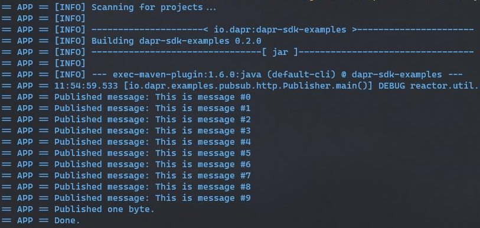
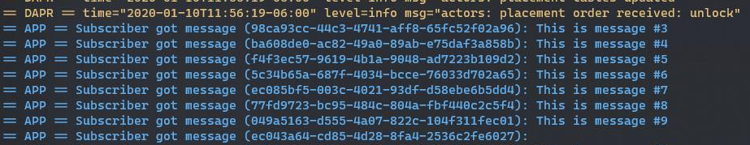

# Dapr Pub-Sub Sample

In this sample, we'll create a publisher and a subscriber java applications using Dapr, based on the publish-subcribe pattern. The publisher will generate messages of a specific topic, while subscriber will listen for messages of specific topic. See [Why Pub-Sub](#why-pub-sub) to understand when this pattern might be a good choice for your software architecture.

Visit [this](https://github.com/dapr/docs/tree/master/concepts/publish-subscribe-messaging) link for more information about Dapr and Pub-Sub.
 
## Pub-Sub Sample using the Java-SDK

This sample uses the HTTP Client provided in Dapr Java SDK for publishing and subscribing,  which uses Redis Streams (enabled in Redis versions => 5).
## Pre-requisites

* [Dapr and Dapr Cli](https://github.com/dapr/docs/blob/master/getting-started/environment-setup.md#environment-setup).
* Java JDK 11 (or greater): [Oracle JDK](https://www.oracle.com/technetwork/java/javase/downloads/index.html#JDK11) or [OpenJDK](https://jdk.java.net/13/).
* [Apache Maven](https://maven.apache.org/install.html) version 3.x.

### Checking out the code

Clone this repository:

```sh
git clone https://github.com/dapr/java-sdk.git
cd java-sdk
```

Then build the Maven project:

```sh
# make sure you are in the `java-sdk` directory.
mvn install
```

### Running the publisher

The first component is the publisher. It is a simple java application with a main method that uses the Dapr HTTP Client to publish 10 messages to an specific topic.

In the `Publisher.java` file, you will find the `Publisher` class, containing the main method. The main method declares a Dapr Client using the `DaprClientBuilder` class. The client publishes messages using `publishEvent` method. See the code snippet below:  
```java
public class Publisher {
    private static final int NUM_MESSAGES = 10;
    private static final String TOPIC_NAME = "testing_topic";
///...
  public static void main(String[] args) throws Exception {
    DaprClient client = new DaprClientBuilder().build(); //Creates a DaprClient using builder
    for (int i = 0; i < NUM_MESSAGES; i++) {
      String message = String.format("This is message #%d", i);
      client.publishEvent(TOPIC_NAME, message).block();
      System.out.println("Published message: " + message);
      //..
    }
///...
}
```

This example also pushes a non-string content event, the follow code in same `Publisher` main method publishes a bite:

```java
public class Publisher {
///...
    public static void main(String[] args) throws Exception {
///...
    //Publishing a single bite: Example of non-string based content published
    client.publishEvent(
        TOPIC_NAME,
        new byte[] { 1 },
        Collections.singletonMap("content-type", "application/octet-stream")).block();
    System.out.println("Published one byte.");
    System.out.println("Done.");
  }
///...
}
```

Use the follow command to execute the Publisher example:

```sh
dapr run --app-id publisher --port 3006 -- mvn exec:java -pl=examples -D exec.mainClass=Publisher
```

Once running, the Publisher should print the output as follows:



Messages have been published in the topic.

### Running the subscriber

The other component is the subscriber. It will subscribe to the same topic used by the publisher and read the messages previously published. In `Subscriber.java` file, you will find the `Subscriber` class and the `main` method. See the code snippet below:

```java
@SpringBootApplication
public class Subscriber {
///...
  public static void main(String[] args) throws Exception {
    Options options = new Options();
    options.addRequiredOption("p", "port", true, "Port Dapr will listen to.");

    CommandLineParser parser = new DefaultParser();
    CommandLine cmd = parser.parse(options, args);

    // If port string is not valid, it will throw an exception.
    int port = Integer.parseInt(cmd.getOptionValue("port"));
    // Subscribe to topic.
    Dapr.getInstance().subscribeToTopic("message", (envelope, metadata) -> Mono
        .fromSupplier(() -> {
          System.out.println("Subscriber got message: " + (envelope.getData() == null ? "" : new String(envelope.getData())));
          return Boolean.TRUE;
        })
        .then(Mono.empty()));

    // Start Dapr's callback endpoint.
    DaprApplication.start(port);
  }
///...
}
```

This class is using the `@SpringBootApplication` annotation which turns this class into a runnable Spring boot application. The code retrieves the port from command parameter, then subcribes to the topic by using `Dapr.getInstance().subscribeToTopic` static method provided in the Java SDK, Through `Dapr` runtime static class. Once recieved, each message is printed in the console.
 
 Execute the follow script in order to run the Subscriber example:
```sh
dapr run --app-id subscriber --app-port 3000 --port 3005 -- mvn exec:java -pl=examples -D exec.mainClass=Subscriber -Dexec.args="-p 3000"
```
Once running, the Subscriber should print the output as follows:



Messages have been retrieved from the topic.

For more details on Dapr Spring Boot integration, please refer to [Dapr Spring Boot](/../java/io/dapr/springboot/DaprApplication.java) Application implementation.